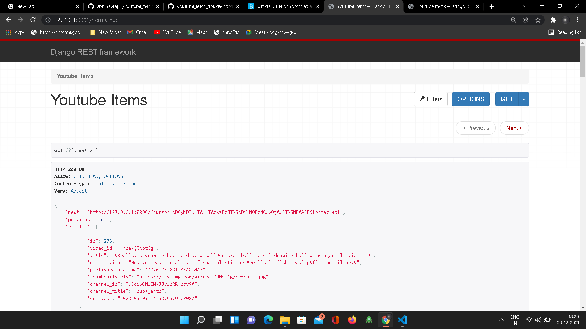
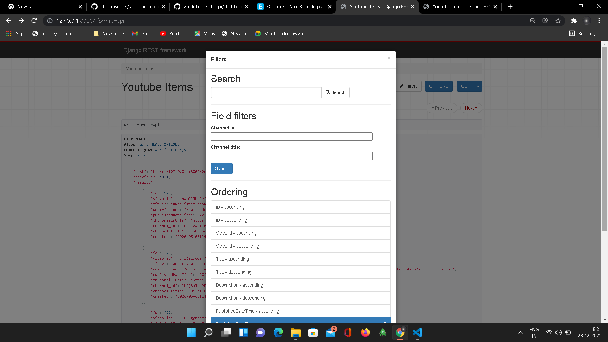

# Youtube Fetch Api
An API to fetch latest videos from youtube sorted in reverse chronological order of their publishing date-time from YouTube for a given tag/search query in a paginated response.

The server fetches latest videos async after every 10 minutes and saves it to the db.

This project is completely based on Django.
# Youtube_Api
 This Api is used to view current fetch videos in Card format with title ,view ,description,date-time and link to the video and a functionality get button to fetch first suggestion. 
## Method Used

Used Cron Jobs [django_cron](https://django-cron.readthedocs.io/en/latest/introduction.html) to fetch videos after every 1 minutes using [Youtube Data Api](https://developers.google.com/youtube/v3/docs/search/list) and save it to the db

## Setup Guide
-Clone the project
# For youtube_api
  -Run pipenv install django
  -Run pip env shell
  -Inside the `setting.py` file, fill the variable `YOUTUBE_API_KEYS` with all the API Keys available,the list should be filled as `['API_KEY_1']`
  - For getting an API key follow [this](https://developers.google.com/youtube/v3/getting-started)
  - Run the server using `python mange.py runserver`

# For youtube_fetch_api
- As this project is based on Django, your system need to have proper python setup, refer [this]
(https://www.python.org/downloads/)
- Run 'pipenv shell' inside youtube_fetch_api then =>
- Go the project through the terminal and install all dependencies by using typing `pip install -r requirements.txt` in the terminal
- Inside the `setting.py` file, fill the variable `Google_API_KEYS` with all the API Keys available,the list should be filled as `['API_KEY_1','API_KEY_2',...]`
- For getting an API key follow [this](https://developers.google.com/youtube/v3/getting-started)
- Setup crontab to run Job, Follow [this](https://django-cron.readthedocs.io/en/latest/installation.html)

- Run the server using `python mange.py runserver`

## Screenshots

For visualization through a dashboard one may directly run the app locally and the get the UI provided through django-rest-framework

### Dashboard

### Filters
